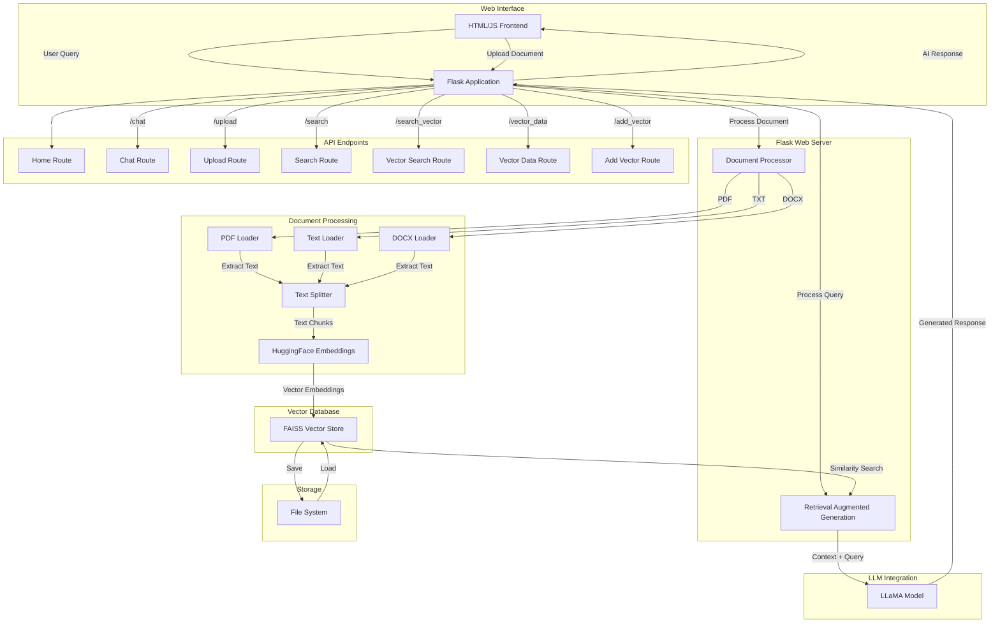

# Chatbot Application Architecture Diagram

## Component Descriptions

### Web Interface
- **HTML/JS Frontend**: Browser-based UI for user interaction, document upload, and chat

### Flask Web Server
- **Flask Application**: Core server handling HTTP requests and coordinating components

### Document Processing
- **Document Processor**: Handles various document formats
- **Loaders**: Format-specific document loaders (PDF, TXT, DOCX)
- **Text Splitter**: Splits documents into manageable chunks for embedding

### Vector Database
- **HuggingFace Embeddings**: Converts text to vector embeddings
- **FAISS Vector Store**: High-performance vector database for similarity search

### LLM Integration
- **Retrieval Augmented Generation (RAG)**: Combines retrieved documents with LLM generation
- **LLaMA Model**: Local LLM for generating responses based on context

### API Endpoints
- **Home Route (/)**: Serves the main UI
- **Chat Route (/chat)**: Handles chat interactions with RAG
- **Upload Route (/upload)**: Processes document uploads
- **Search Route (/search)**: Performs vector search
- **Vector Routes**: Advanced vector database management endpoints

### Storage
- **File System**: Persistent storage for vector database

## Data Flow

1. **Document Ingestion Flow**:
   - User uploads document → Document Processor extracts text → Text Splitter creates chunks → HuggingFace Embeddings converts to vectors → FAISS stores vectors

2. **Query Processing Flow**:
   - User sends query → FAISS performs similarity search → RAG combines query with relevant documents → LLaMA generates response → Response returned to user

## Technical Details

- **Embedding Model**: HuggingFace sentence-transformers
- **Vector Database**: FAISS (Facebook AI Similarity Search)
- **LLM**: LLaMA 2 (7B parameters) with quantization
- **Document Processing**: LangChain document loaders and text splitters
- **Web Framework**: Flask
